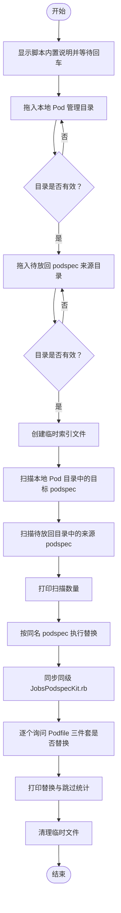
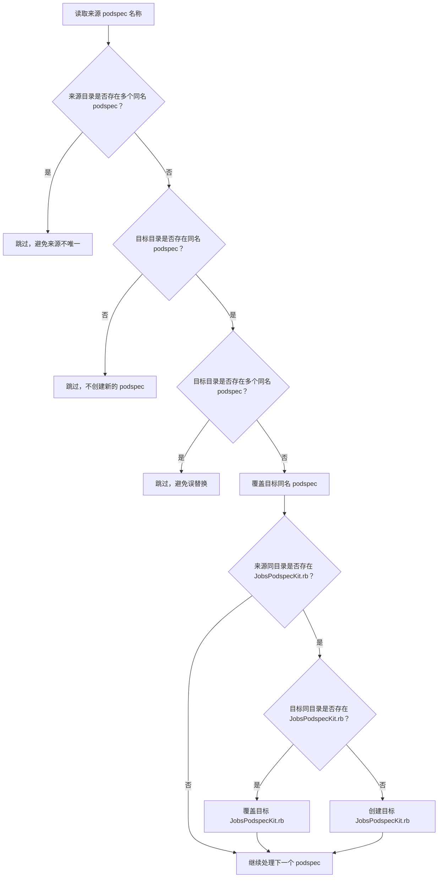
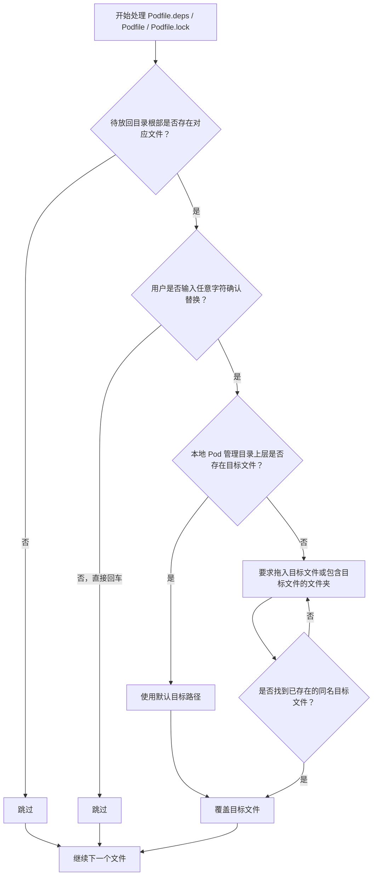

# **MacOS** ♻️放回本地 Pod 的 [**CocoaPods**](https://cocoapods.org/) 相关文件

<p align="left">
  <a href="https://cocoapods.org/"></a>
  <a href="https://www.ruby-lang.org/"></a>
  <a></a>
  <a></a>
  <a></a>
  <a></a>
</p>


[toc]

## 🔥 <font id=前言>前言</font>

- 采用 Shell 脚本的原因：Shell 来自 [**macOS**](https://www.apple.com/macos/) 原生系统底层，虽然写法相对繁琐冗杂，但执行效率高，并且不需要额外介入 [**Ruby**](https://www.ruby-lang.org)、[**Python**](https://www.python.org) 等第三方运行环境，因此具备更好的移植性。

> 当前总行数：714

- 🔧 **工欲善其事必先利其器**

- 🌋 **站在巨人的肩膀上，才能看得更远**

- ✝️ **面向信仰编程**

- 📚 **参考来源**：[**CocoaPods**](https://cocoapods.org/)｜[**Ruby**](https://www.ruby-lang.org/)｜[**zsh**](https://www.zsh.org/)

- 🔔 **温馨提示**：本文较长，直接访问 [**Github**](https://github.com/) 可能无法完整阅读全文

  * 推荐下载到本地阅读，推荐阅读器 ➤ [**Typora**](https://typora.io/)

  * 或者使用 [**Google Chrom**e](https://www.google.com/chrome/) 浏览器安装 `Markdown Preview Plus` 插件并启用

- 本脚本用于把已经整理、解耦或批量处理后的 `.podspec` 文件，按同名规则放回本地 Pod 管理目录中的对应 Pod。

- 如果来源 `.podspec` 同目录存在 `JobsPodspecKit.rb`，脚本会把它同步放回目标 `.podspec` 同级目录。这个设计适合每个 Pod 作为独立工程维护：`.podspec` 负责声明规格，`JobsPodspecKit.rb` 负责承载从 podspec 中拆出去的 Ruby 辅助逻辑。

- `Podfile`、`Podfile.deps`、`Podfile.lock` 不会默认替换，脚本会逐个询问。直接回车跳过，输入任意字符后回车才执行替换。

## 一、🎯 项目白皮书 <a href="#前言" style="font-size:17px; color:green;"><b>🔼</b></a> <a href="#🔚" style="font-size:17px; color:green;"><b>🔽</b></a>

这个脚本解决的是本地 Pod 体系中 `.podspec` 解耦后的安全放回问题。

典型场景如下：

- 你把一批本地 Pod 的 `.podspec` 抽取出来统一处理
- 你对 `.podspec` 做了结构解耦
- 每个 Pod 拆成 `.podspec + JobsPodspecKit.rb`
- 处理完成后，需要把这些文件按 Pod 名称放回原来的本地 Pod 目录
- 同时希望避免误创建、误覆盖、误替换不存在的文件

脚本核心策略是：

- 只按同名 `.podspec` 精确匹配
- 只替换目标中已经存在的 `.podspec`
- 来源中存在 `JobsPodspecKit.rb` 时，同步到目标 `.podspec` 同目录
- `Podfile` 三件套只在用户确认后替换
- 对重复同名文件采取跳过策略，避免误判
- 支持拖入路径中的空格、引号、反斜杠转义、`~`、Unix 软链接和 Finder 替身

最终处理对象如下：

| 文件 | 处理方式 | 是否默认替换 | 是否允许创建 |
| --- | --- | --- | --- |
| `.podspec` | 按文件名精确匹配并覆盖目标同名文件 | 是 | 否 |
| `JobsPodspecKit.rb` | 来源 `.podspec` 同目录存在时，同步到目标 `.podspec` 同目录 | 是 | 是，仅目标同目录不存在时创建 |
| `Podfile.deps` | 来源根目录存在时，询问后替换 | 否，需确认 | 否 |
| `Podfile` | 来源根目录存在时，询问后替换 | 否，需确认 | 否 |
| `Podfile.lock` | 来源根目录存在时，询问后替换 | 否，需确认 | 否 |

## 二、🧭 脚本执行流程 <a href="#前言" style="font-size:17px; color:green;"><b>🔼</b></a> <a href="#🔚" style="font-size:17px; color:green;"><b>🔽</b></a>

基础放回主流程如下：



`.podspec` 匹配流程如下：



`Podfile` 三件套处理流程如下：



## 三、🧩 功能清单 <a href="#前言" style="font-size:17px; color:green;"><b>🔼</b></a> <a href="#🔚" style="font-size:17px; color:green;"><b>🔽</b></a>

### 1、启动前置说明

脚本双击运行后，会先显示内置说明，并等待用户按回车确认。这样可以避免误触后直接替换本地 Pod 文件。

### 2、本地 Pod 管理目录选择

脚本第一步会要求拖入管理本地 Pod 的文件夹。

这个目录通常类似：

```text
/Users/jobs/Desktop/JobsOCBaseConfigDemo/JobsByPods
```

脚本会在该目录下查找 `.podspec`，但只接受根目录或一级子目录内的 `.podspec`。

也就是说，以下结构会被识别：

```text
JobsByPods/AAA.podspec
JobsByPods/AAA@Pods/AAA.podspec
```

以下结构不会作为有效目标：

```text
JobsByPods/AAA@Pods/SubDir/AAA.podspec
```

### 3、待放回目录选择

脚本第二步会要求拖入装有 `.podspec` 的来源文件夹。

这个目录通常是你批量处理、解耦、导出后的目录，例如：

```text
PodspecFiles_Decoupled_PerPodNamespace_20260515_0945
```

脚本同样只接受根目录或一级子目录内的 `.podspec`。

推荐来源结构：

```text
PodspecFiles_Decoupled_PerPodNamespace_20260515_0945/
├── BRPickerViewExtra.podspec/
│   ├── BRPickerViewExtra.podspec
│   └── JobsPodspecKit.rb
├── FDFullscreenPopGesture.podspec/
│   ├── FDFullscreenPopGesture.podspec
│   └── JobsPodspecKit.rb
├── Podfile
├── Podfile.deps
└── Podfile.lock
```

### 4、`.podspec` 同名替换

脚本以 `.podspec` 文件名作为唯一匹配依据。

例如：

```text
来源：BRPickerViewExtra.podspec
目标：BRPickerViewExtra.podspec
```

只要文件名一致，并且来源和目标都唯一，脚本就会用来源文件覆盖目标文件。

脚本不会按目录名匹配，也不会根据 Pod 内部 `spec.name` 推断目标。

### 5、`JobsPodspecKit.rb` 同步

如果来源 `.podspec` 同目录存在：

```text
JobsPodspecKit.rb
```

脚本会把它同步到目标 `.podspec` 同级目录。

处理规则如下：

- 目标同级已经存在 `JobsPodspecKit.rb`：覆盖
- 目标同级不存在 `JobsPodspecKit.rb`：创建
- 目标路径存在但不是文件：跳过
- 来源路径存在但不是文件：跳过

这个逻辑适合 `.podspec + JobsPodspecKit.rb` 的解耦结构，尤其适合每个 Pod 使用独立 Ruby 命名空间的方案。

### 6、`Podfile` 三件套可选替换

脚本会依次处理：

```text
Podfile.deps
Podfile
Podfile.lock
```

交互规则：

```text
直接按 [Enter]：跳过替换
输入任意字符后回车：执行替换
```

这三个文件的来源位置必须在待放回目录根部，例如：

```text
待放回目录/Podfile
待放回目录/Podfile.deps
待放回目录/Podfile.lock
```

目标默认位置是本地 Pod 管理目录的上层目录。

例如本地 Pod 管理目录是：

```text
/Users/jobs/Desktop/JobsOCBaseConfigDemo/JobsByPods
```

那么默认目标就是：

```text
/Users/jobs/Desktop/JobsOCBaseConfigDemo/Podfile
/Users/jobs/Desktop/JobsOCBaseConfigDemo/Podfile.deps
/Users/jobs/Desktop/JobsOCBaseConfigDemo/Podfile.lock
```

默认位置不存在时，脚本会要求你手动拖入目标文件，或者拖入包含目标文件的文件夹。

### 7、路径兼容能力

脚本支持以下输入情况：

- Finder 拖入路径
- 路径中包含空格
- 路径被单引号包裹
- 路径被双引号包裹
- 路径中包含反斜杠转义
- `~` 和 `~/xxx`
- Unix 软链接
- Finder 替身

脚本会尽量把输入路径解析为真实路径后再执行替换。

### 8、重复文件保护

如果来源目录中出现多个同名 `.podspec`，脚本会跳过该文件名。

如果目标目录中出现多个同名 `.podspec`，脚本也会跳过该文件名。

这个策略看起来保守，但对本地 Pod 批量替换更安全：宁可跳过，也不要猜。

### 9、临时文件清理

脚本运行过程中会在 `/tmp` 下创建临时索引文件，用于记录来源、目标和已处理文件名。

脚本退出时会自动清理这些临时文件。

## 四、📁 目录结构建议 <a href="#前言" style="font-size:17px; color:green;"><b>🔼</b></a> <a href="#🔚" style="font-size:17px; color:green;"><b>🔽</b></a>

### 1、本地工程推荐结构

```text
JobsOCBaseConfigDemo/
├── Podfile
├── Podfile.deps
├── Podfile.lock
└── JobsByPods/
    ├── BRPickerViewExtra@Pods/
    │   ├── BRPickerViewExtra.podspec
    │   └── JobsPodspecKit.rb
    ├── FDFullscreenPopGesture@Pods/
    │   ├── FDFullscreenPopGesture.podspec
    │   └── JobsPodspecKit.rb
    └── JobsBaseUI@Pods/
        ├── JobsBaseUI.podspec
        └── JobsPodspecKit.rb
```

### 2、待放回目录推荐结构

```text
PodspecFiles_Decoupled_PerPodNamespace_20260515_0945/
├── BRPickerViewExtra.podspec/
│   ├── BRPickerViewExtra.podspec
│   └── JobsPodspecKit.rb
├── FDFullscreenPopGesture.podspec/
│   ├── FDFullscreenPopGesture.podspec
│   └── JobsPodspecKit.rb
├── JobsBaseUI.podspec/
│   ├── JobsBaseUI.podspec
│   └── JobsPodspecKit.rb
├── Podfile
├── Podfile.deps
└── Podfile.lock
```

### 3、不推荐结构

不推荐把 `.podspec` 放到更深层级：

```text
PodspecFiles_Decoupled/BRPickerViewExtra/Inner/BRPickerViewExtra.podspec
```

不推荐出现多个同名 `.podspec`：

```text
PodspecFiles_Decoupled/A/BRPickerViewExtra.podspec
PodspecFiles_Decoupled/B/BRPickerViewExtra.podspec
```

不推荐只复制 `.podspec`，不复制 `JobsPodspecKit.rb`：

```text
BRPickerViewExtra@Pods/
└── BRPickerViewExtra.podspec
```

如果 podspec 内部使用了：

```ruby
require_relative 'JobsPodspecKit'
```

那么同级必须存在：

```text
JobsPodspecKit.rb
```

## 五、🚀 使用方式 <a href="#前言" style="font-size:17px; color:green;"><b>🔼</b></a> <a href="#🔚" style="font-size:17px; color:green;"><b>🔽</b></a>

### 1、双击运行

直接双击：

```text
【MacOS】♻️放回本地Pod的podspec.command
```

脚本会打开终端并显示说明。

### 2、终端运行

如果系统提示没有执行权限，可以先执行：

```shell
chmod +x "【MacOS】♻️放回本地Pod的podspec.command"
```

然后运行：

```shell
"./【MacOS】♻️放回本地Pod的podspec.command"
```

### 3、第一步拖入本地 Pod 管理目录

示例：

```text
请把管理本地 Pod 的文件夹拖到这里，然后按回车：
```

拖入：

```text
/Users/jobs/Desktop/JobsOCBaseConfigDemo/JobsByPods
```

脚本会解析并打印：

```text
已解析本地 Pod 管理目录：/Users/jobs/Desktop/JobsOCBaseConfigDemo/JobsByPods
```

### 4、第二步拖入待放回目录

示例：

```text
请把装有 .podspec 的文件夹拖到这里，然后按回车：
```

拖入：

```text
/Users/jobs/Desktop/PodspecFiles_Decoupled_PerPodNamespace_20260515_0945
```

脚本会解析并打印：

```text
已解析待放回目录：/Users/jobs/Desktop/PodspecFiles_Decoupled_PerPodNamespace_20260515_0945
```

### 5、确认 `Podfile` 三件套

脚本会逐个询问：

```text
是否替换 Podfile.deps？直接回车 = 跳过，输入任意字符后回车 = 替换：
是否替换 Podfile？直接回车 = 跳过，输入任意字符后回车 = 替换：
是否替换 Podfile.lock？直接回车 = 跳过，输入任意字符后回车 = 替换：
```

默认建议：

- 只处理 podspec 解耦结果：直接回车跳过三件套
- 确认来源目录内三件套就是你要同步的版本：输入任意字符后回车替换
- 不确定：跳过，后续手动 diff

## 六、🧪 常用自检命令 <a href="#前言" style="font-size:17px; color:green;"><b>🔼</b></a> <a href="#🔚" style="font-size:17px; color:green;"><b>🔽</b></a>

### 1、检查目标 Pod 是否存在 `JobsPodspecKit.rb`

```shell
find JobsByPods -name JobsPodspecKit.rb -print
```

### 2、检查 podspec 是否还引用了缺失的 `JobsPodspecKit`

```shell
grep -R "require_relative ['\"]JobsPodspecKit['\"]" JobsByPods || true
```

如果有输出，说明对应 Pod 的 `.podspec` 依赖同级 `JobsPodspecKit.rb`。

### 3、检查是否还有旧的公共命名空间

如果你已经切换到每个 Pod 独立 Ruby 命名空间，可以检查是否还存在旧写法：

```shell
grep -R "module JobsPodspecKit$" JobsByPods || true
```

更理想的写法应该类似：

```ruby
module JobsPodspecKitForBRPickerViewExtra
```

### 4、检查 podspec Ruby 语法

```shell
find JobsByPods -name "*.podspec" -print0 | while IFS= read -r -d '' file; do
  ruby -c "$file" || exit 1
done
```

### 5、检查 JobsPodspecKit Ruby 语法

```shell
find JobsByPods -name "JobsPodspecKit.rb" -print0 | while IFS= read -r -d '' file; do
  ruby -c "$file" || exit 1
done
```

### 6、检查 Git 修改内容

```shell
git status --short
git diff -- JobsByPods
git diff -- Podfile Podfile.deps Podfile.lock
```

### 7、重新安装 Pods

```shell
pod install
```

如果 `pod install` 中出现 `already initialized constant JobsPodspecKit`，通常说明某些 Pod 的 `JobsPodspecKit.rb` 仍然使用了相同的顶层模块名，需要改成每个 Pod 独立命名空间。

## 七、⚠️ 常见问题 <a href="#前言" style="font-size:17px; color:green;"><b>🔼</b></a> <a href="#🔚" style="font-size:17px; color:green;"><b>🔽</b></a>

### 1、为什么 `.podspec` 不存在时不自动创建？

因为这个脚本是“放回”和“替换”，不是“新增 Pod”。

如果目标目录里没有同名 `.podspec`，脚本无法判断这个文件应该属于哪个本地 Pod。自动创建反而容易把文件放错位置。

### 2、为什么来源或目标存在多个同名 `.podspec` 会跳过？

因为同名重复代表匹配不唯一。

本脚本不做猜测。只要来源或目标有歧义，就跳过，让用户手动处理。

### 3、为什么 `JobsPodspecKit.rb` 可以创建，而 `.podspec` 不创建？

因为 `JobsPodspecKit.rb` 是跟随已经匹配成功的 `.podspec` 放回的。

只要 `.podspec` 目标已经唯一确定，那么它的同级目录就是明确的，创建 `JobsPodspecKit.rb` 是安全的。

### 4、为什么 `Podfile` 三件套默认跳过？

`Podfile`、`Podfile.deps`、`Podfile.lock` 影响的是整个工程依赖解析，不是单个 Pod。

所以脚本不会默认替换，必须由用户逐个确认。

### 5、替换前会自动备份吗？

不会。

脚本使用 `cp -p` 直接覆盖目标文件，并尽量保留文件权限与时间信息。

建议在运行前确保工程处于 Git 管理下，并先执行：

```shell
git status --short
```

必要时先提交或手动备份。

### 6、拖入路径带空格会不会出问题？

正常不会。

脚本会处理空格、引号、反斜杠转义和 `~`，也会尽量解析 Unix 软链接与 Finder 替身。

### 7、为什么只扫描到一级子目录？

这是为了贴合本地 Pod 管理目录和导出目录的结构，避免递归太深误扫到历史备份、示例工程、Pods 产物或其他无关 podspec。

### 8、替换后 `pod install` 还有 warning 怎么办？

先检查是否仍然存在旧的公共 Ruby 命名空间：

```shell
grep -R "module JobsPodspecKit$" JobsByPods || true
```

如果有输出，说明部分 `JobsPodspecKit.rb` 仍然定义了同名顶层模块。

推荐使用独立命名空间，例如：

```ruby
module JobsPodspecKitForBRPickerViewExtra
```

同时 `.podspec` 内也要调用对应模块名。

### 9、替换后提示 `cannot load such file -- JobsPodspecKit` 怎么办？

说明 `.podspec` 里存在：

```ruby
require_relative 'JobsPodspecKit'
```

但目标 `.podspec` 同级目录没有 `JobsPodspecKit.rb`。

解决方式：

```shell
find JobsByPods -name JobsPodspecKit.rb -print
```

确认对应 Pod 目录下存在该文件。如果不存在，重新运行本脚本，并确认来源 `.podspec` 同目录存在 `JobsPodspecKit.rb`。

## 八、🧨 安全边界 <a href="#前言" style="font-size:17px; color:green;"><b>🔼</b></a> <a href="#🔚" style="font-size:17px; color:green;"><b>🔽</b></a>

这个脚本会做的事情：

- 替换已经存在的同名 `.podspec`
- 同步来源同目录下的 `JobsPodspecKit.rb`
- 在目标 `.podspec` 同目录缺少 `JobsPodspecKit.rb` 时创建该文件
- 在用户确认后替换 `Podfile.deps`
- 在用户确认后替换 `Podfile`
- 在用户确认后替换 `Podfile.lock`
- 打印替换和跳过统计

这个脚本不会做的事情：

- 不会创建新的 `.podspec`
- 不会新建 `Podfile`
- 不会新建 `Podfile.deps`
- 不会新建 `Podfile.lock`
- 不会修改 `.podspec` 内容
- 不会分析 podspec 依赖关系
- 不会执行 `pod install`
- 不会自动备份旧文件
- 不会安装 Homebrew 或其他依赖

## 九、✅ 总结 <a href="#前言" style="font-size:17px; color:green;"><b>🔼</b></a> <a href="#🔚" style="font-size:17px; color:green;"><b>🔽</b></a>

这个脚本的核心目标是：

- 把批量处理后的 `.podspec` 安全放回本地 Pod 目录
- 保留每个 Pod 独立工程的 `.podspec + JobsPodspecKit.rb` 解耦结构
- 避免来源或目标不唯一时误替换
- 避免自动创建新的 podspec 导致目录污染
- 让 `Podfile` 三件套替换保持显式确认
- 支持 Finder 拖入路径，降低手动输入路径的错误率

真正稳的工作流应该是：

```text
导出 podspec → 批量解耦 → 生成 .podspec + JobsPodspecKit.rb → 运行本脚本放回 → git diff 检查 → pod install 验证
```

## 十、日志文件

运行日志默认写入 `/tmp`，文件名通常来自脚本名去掉扩展名：

```shell
/tmp/【MacOS】♻️放回本地Pod的podspec.log
```

<a id="🔚" href="#前言" style="font-size:17px; color:green; font-weight:bold;">我是有底线的➤点我回到首页</a>
