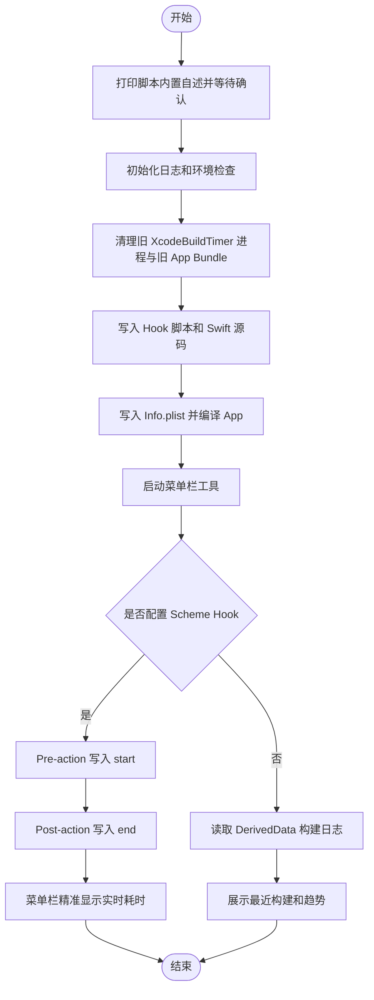

# `【MacOS】⌚️Xcode编译耗时菜单栏.command`


[toc]

---

## 🔥 <font id=前言>前言</font>

> 这是一份双击脚本外部 README，面向运行前阅读；脚本运行后还会打印内置自述并等待确认，README 不替代脚本自身的防误触提示。

- 本脚本用于在 [**macOS**](https://www.apple.com/macos/) 上生成并启动一个 `XcodeBuildTimer` 菜单栏小工具，在右上角菜单栏显示 [**Xcode**](https://developer.apple.com/xcode) 构建耗时。
- 菜单栏工具支持两种计时来源：配置 Scheme Hook 后获得精准开始 / 结束计时；未配置 Hook 时，自动读取 `DerivedData/Logs/Build` 里的 `.xcactivitylog` 展示最近构建记录。
- 脚本会使用 [**Swift**](https://www.swift.org/) / `swiftc` 编译一个本机 App Bundle，并写入用户主目录下的 `.xcode-build-timer/` 工作目录。
- 脚本默认不修改 Xcode 工程文件；只有在菜单栏工具里主动点击 `配置 Scheme Hook` 并确认后，才会修改对应工程的 `.xcscheme`。

## 一、适用场景 <a href="#前言" style="font-size:17px; color:green;"><b>🔼</b></a> <a href="#🔚" style="font-size:17px; color:green;"><b>🔽</b></a>

- 想在 macOS 菜单栏实时看到 Xcode 当前编译已经耗时多久。
- 想快速查看最近构建的耗时、状态、慢 Swift 编译项、慢脚本阶段和疑似慢 target。
- 想用轻量方式观察多工程、多 Scheme、多 SDK / 设备组合的构建耗时。
- 不想给 Xcode 安装插件，只希望通过本地脚本生成一个菜单栏辅助工具。

## 二、脚本信息 <a href="#前言" style="font-size:17px; color:green;"><b>🔼</b></a> <a href="#🔚" style="font-size:17px; color:green;"><b>🔽</b></a>

| 项目 | 说明 |
| --- | --- |
| 脚本名称 | `【MacOS】⌚️Xcode编译耗时菜单栏.command` |
| 所属目录 | `JobsGenesis/JobsCommand@iOS/其他` |
| 主要用途 | 生成并启动 `XcodeBuildTimer` 菜单栏工具 |
| 依赖工具 | `xcrun`、`swiftc`、`open`、`gzip`、`ps`、`osascript` |
| 工作目录 | 用户主目录下的 `.xcode-build-timer/` |
| 是否可能联网 | 否。脚本不安装依赖，也不拉取网络资源 |
| 是否修改工程 | 默认否。仅在菜单栏中确认配置 Scheme Hook 后修改 `.xcscheme` |
| 是否含高风险操作 | 有边界风险。会结束旧的 `XcodeBuildTimer` 进程，清理旧 App Bundle；刷新菜单栏必须输入 `YES` |
| 日志位置 | 系统临时目录中的 `【MacOS】⌚️Xcode编译耗时菜单栏.log` |

## 三、运行方式 <a href="#前言" style="font-size:17px; color:green;"><b>🔼</b></a> <a href="#🔚" style="font-size:17px; color:green;"><b>🔽</b></a>

- 推荐方式：双击 `【MacOS】⌚️Xcode编译耗时菜单栏.command`。
- 终端方式：

  ```shell
  cd '.'
  chmod +x './【MacOS】⌚️Xcode编译耗时菜单栏.command'
  './【MacOS】⌚️Xcode编译耗时菜单栏.command'
  ```

- 脚本启动后会先打印内置自述，并等待回车确认。确认前不会生成源码、清理旧 App Bundle、编译工具或启动菜单栏 App。
- 取消方式：在确认前按 `Ctrl+C` 终止。

## 四、执行流程 <a href="#前言" style="font-size:17px; color:green;"><b>🔼</b></a> <a href="#🔚" style="font-size:17px; color:green;"><b>🔽</b></a>

1. 打印脚本内置自述，说明用途、影响范围、日志位置和取消方式。
2. 初始化日志，日志同步写入系统临时目录中的脚本同名 `.log` 文件。
3. 检查当前芯片架构，确认存在 `xcrun` 和 `swiftc`。
4. 如果未发现 `DerivedData`，脚本仍会继续启动；等 Xcode 产生构建日志后菜单栏自动刷新。
5. 结束旧的 `XcodeBuildTimer` 进程，清理旧的 App Bundle 和残留计时状态。
6. 写入 `xbt-build-hook.sh`。如果已存在，默认回车跳过替换，输入任意字符后回车才替换。
7. 写入 Swift 源码、`Info.plist`，并按当前 Mac 架构编译本机 App。
8. 启动菜单栏工具，在右上角显示 `⏱XBT` 或当前耗时。
9. 打印手动配置 Scheme Hook 的命令提示。
10. 询问是否刷新 `SystemUIServer`。只有输入 `YES` 才会刷新菜单栏并重新打开工具。

## 五、菜单栏能力 <a href="#前言" style="font-size:17px; color:green;"><b>🔼</b></a> <a href="#🔚" style="font-size:17px; color:green;"><b>🔽</b></a>

- 菜单栏标题：

  | 状态 | 显示 |
  | --- | --- |
  | 无构建记录 | `⏱XBT` |
  | Hook 精准计时中 | `⏱mm:ss` 或 `⏱mm:ss×数量` |
  | 仅推断到构建活动 | `⏱~mm:ss` |
  | 最近构建已结束 | 显示最近一次构建耗时 |

- 菜单内容：

  | 菜单区域 | 说明 |
  | --- | --- |
  | `正在编译` / `最近 Hook 计时` | 展示工程、Scheme、配置、SDK、设备和耗时 |
  | `最近构建` | 读取 `.xcactivitylog` 展示最近构建记录 |
  | `趋势` | 展示今日构建次数、平均耗时、最长耗时、最短耗时 |
  | `慢 Swift 编译项` | 从最新构建日志提取疑似慢 Swift 编译片段 |
  | `慢脚本阶段` | 从最新构建日志提取 `Run Script` / `PhaseScriptExecution` 片段 |
  | `疑似慢 target` | 从最新构建日志提取 target 相关片段 |
  | `打开悬浮窗` | 打开实时看板窗口，显示当前计时和最近构建 |
  | `打开 DerivedData` | 打开 Xcode 的 `DerivedData` 目录 |
  | `清除计时` | 清空本工具计时状态，不删除 Xcode 构建日志 |
  | `清除历史记录` | 清空菜单中的历史展示，不删除原始 `.xcactivitylog` |

## 六、Scheme Hook 配置 <a href="#前言" style="font-size:17px; color:green;"><b>🔼</b></a> <a href="#🔚" style="font-size:17px; color:green;"><b>🔽</b></a>

- 推荐方式：启动菜单栏工具后，先在 Xcode 打开 `.xcworkspace` 或 `.xcodeproj`，再从菜单栏选择 `配置 Scheme Hook`，选择对应工程和 Scheme，弹窗确认后自动写入。
- 手动方式：进入 `Product -> Scheme -> Edit Scheme...`，在 `Build` 动作里配置：

  | 位置 | 脚本内容 |
  | --- | --- |
  | `Pre-actions` | 使用脚本运行后终端打印的 `Pre-action 脚本` |
  | `Post-actions` | 使用脚本运行后终端打印的 `Post-action 脚本` |

- 终端打印的 Hook 命令会使用当前用户主目录下的 `.xcode-build-timer/xbt-build-hook.sh` 完整路径；在 Xcode 的 Shell Script Action 里不要写中文占位路径。
- 两个 Action 都建议选择 `Provide build settings from` 当前 App Target，这样 Hook 可以拿到 `PROJECT_NAME`、`SCHEME_NAME`、`CONFIGURATION`、`SDK_NAME`、运行设备等构建上下文。
- 自动配置会移除同一 `.xcscheme` 中旧的 `xbt-build-hook.sh` Action，再插入新的 Pre / Post Action，避免重复写入。
- 自动配置不会创建 `.xcscheme` 备份。共享 Scheme 或团队仓库里使用前，建议先确认 Git 工作区干净。

## 七、执行前检查 <a href="#前言" style="font-size:17px; color:green;"><b>🔼</b></a> <a href="#🔚" style="font-size:17px; color:green;"><b>🔽</b></a>

- 确认本机已安装完整 Xcode 或 Command Line Tools，且 `xcrun --find swiftc` 能找到 Swift 编译器。
- 如果需要配置 Hook，请先在 Xcode 打开目标 `.xcworkspace` 或 `.xcodeproj`。
- 如果目标 Scheme 文件已经纳入 Git 管理，建议先提交或备份本地改动，再从菜单栏执行 `配置 Scheme Hook`。
- 如果右上角菜单栏图标异常，脚本末尾可以输入 `YES` 刷新 `SystemUIServer`；默认直接回车会跳过。

## 八、流程图 <a href="#前言" style="font-size:17px; color:green;"><b>🔼</b></a> <a href="#🔚" style="font-size:17px; color:green;"><b>🔽</b></a>



## 九、风险边界 <a href="#前言" style="font-size:17px; color:green;"><b>🔼</b></a> <a href="#🔚" style="font-size:17px; color:green;"><b>🔽</b></a>

- 脚本运行阶段会写入用户主目录下的 `.xcode-build-timer/`，包含 Swift 源码、App Bundle、Hook 脚本、计时状态和运行日志。
- 脚本运行阶段会结束旧的 `XcodeBuildTimer` 进程，并清理旧 App Bundle；不会结束 Xcode，不会清理项目源码，不会删除 `DerivedData`。
- 菜单栏中点击 `配置 Scheme Hook` 并确认后，会直接改写对应 `.xcscheme`，用于插入 XBT 的 Pre / Post Action。
- 菜单栏中的 `清除历史记录` 不删除原始 `.xcactivitylog`；只是隐藏本工具菜单里的历史展示。
- 菜单栏中的 `清除计时` 会清理本工具状态文件，不影响 Xcode 构建产物。
- 刷新 `SystemUIServer` 会让右上角菜单栏图标短暂消失并自动恢复；必须输入 `YES` 才会执行。

## 十、常见问题 <a href="#前言" style="font-size:17px; color:green;"><b>🔼</b></a> <a href="#🔚" style="font-size:17px; color:green;"><b>🔽</b></a>

- 右上角没有看到 `⏱XBT`：

  确认脚本编译和启动阶段没有报错。若脚本提示可以刷新菜单栏，输入 `YES` 后会重启 `SystemUIServer` 并重新打开工具。

- 菜单里只有最近构建，没有实时计时：

  说明还没有配置 Scheme Hook，或当前 Scheme 没有触发 Hook。先在 Xcode 打开工程，再从菜单栏执行 `配置 Scheme Hook`。

- 配置 Scheme Hook 后仍然不准：

  确认 Pre / Post Action 都存在，并且 `Provide build settings from` 选择了当前 App Target。否则 Hook 可能拿不到完整构建上下文。

- Xcode 工程列表为空：

  先在 Xcode 打开 `.xcworkspace` 或 `.xcodeproj`。菜单栏工具通过 `osascript` 读取当前 Xcode 打开的文档路径。

- 想停用这个工具：

  在菜单栏里选择 `退出`。如需移除 Hook，需要到 Xcode Scheme 里删除对应的 XBT Pre / Post Action，或还原 `.xcscheme` 文件。

## 十一、未执行声明 <a href="#前言" style="font-size:17px; color:green;"><b>🔼</b></a> <a href="#🔚" style="font-size:17px; color:green;"><b>🔽</b></a>

- 本 README 编写过程未实际运行该脚本，未执行 `swiftc` 编译、未启动菜单栏 App、未刷新 `SystemUIServer`、未修改任何 `.xcscheme`。
- 本 README 仅根据脚本源码描述实际行为；如脚本后续调整，README 需要同步维护。

<a id="🔚" href="#前言" style="font-size:17px; color:green; font-weight:bold;">我是有底线的➤点我回到首页</a>
