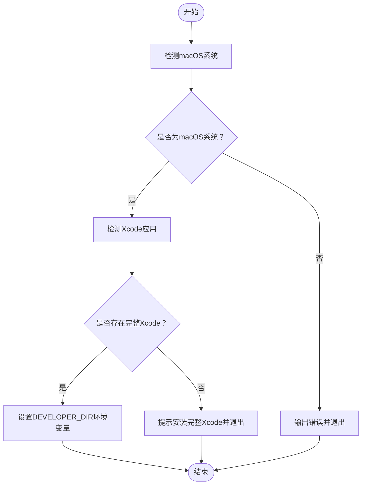

# simios.command


[toc]

## 🔥 <font id=前言>前言</font>

- 采用 Shell 脚本的原因：Shell 来自 [**macOS**](https://www.apple.com/macos/) 原生系统底层，虽然写法相对繁琐冗杂，但执行效率高，并且不需要额外介入 [**Ruby**](https://www.ruby-lang.org)、[**Python**](https://www.python.org) 等第三方运行环境，因此具备更好的移植性。


用途：在确认完整 **Xcode** 存在之后，检测并补齐执行 `xcodebuild -downloadPlatform iOS` 前需要的本地环境，然后下载 / 补齐 **iOS Simulator Runtime**

## 一、做了什么

- 检测是否为 **MacOS**
- 检测是否存在完整 `Xcode.app`
- 检测 `xcode-select` 当前指向
- 本次脚本会临时使用 `DEVELOPER_DIR` 指向检测到的 **Xcode**，避免强制改全局环境
- 可以在交互里永久切换 `xcode-select`（可选）
- 检测 `xcodebuild` 是否支持 `downloadPlatform`
- 检测 **Xcode** 首次启动组件
- 检测 **Xcode** license
- 检测磁盘空间和网络连通
- 最后询问是否执行 **iOS Simulator Runtime** 下载



## 二、核心下载命令

脚本最终执行等效命令：

```bash
xcodebuild -downloadPlatform iOS -verbose
```

说明：`xcodebuild` 常见官方参数是单横线 `-verbose`。如果当前 **Xcode** 的 help 明确支持 `--verbose`，脚本会自动改用 `--verbose`。

## 三、交互规则

普通安装 / 更新 / 升级动作：

- 直接回车：跳过
- 输入任意字符后回车：执行

**Xcode** 首次启动组件、license 这类会直接影响 `xcodebuild` 的必要项，脚本会明确提示原因，再让你继续。

## 四、不做的事

- 脚本不会为了这件事额外安装 **Homebrew**、**CocoaPods**、**Flutter**、**Ruby**、**Node** 等工具。它们不是 `xcodebuild -downloadPlatform iOS` 的必要前置条件

- 脚本也不会在未检测到 **Xcode** 时强行安装 **Xcode**。**Xcode** 体积庞大、来源涉及 App Store / Apple Developer / Apple ID，不适合在这个 Runtime 下载脚本里硬塞自动安装逻辑。

## 五、日志文件

运行日志默认写入 `/tmp`，文件名通常来自脚本名去掉扩展名：

```shell
/tmp/【MacOS】⏬simios.log
```

<a id="🔚" href="#前言" style="font-size:17px; color:green; font-weight:bold;">我是有底线的➤点我回到首页</a>
