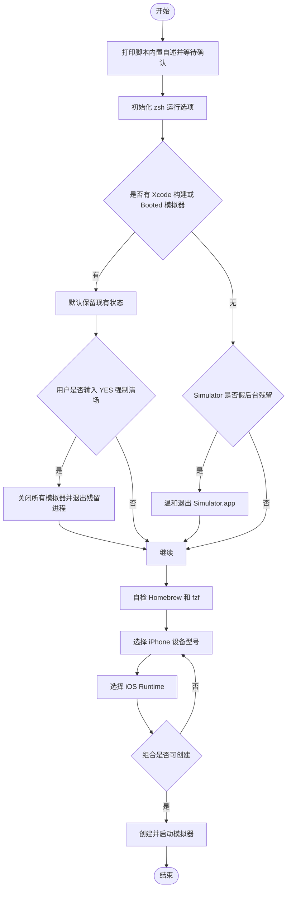

# `【MacOS】📱双击初始化iOS模拟器.command`


[toc]

---

## 🔥 <font id=前言>前言</font>

> 这是一份双击脚本外部 README，面向运行前阅读；脚本运行后还会打印内置自述并等待确认，README 不替代脚本自身的防误触提示。

- 本脚本用于在 [**macOS**](https://www.apple.com/macos/) 上交互选择 iPhone 设备型号和 iOS Runtime，创建并启动一个新的 iOS 模拟器。
- 脚本依赖 [**Xcode**](https://developer.apple.com/xcode) / `xcrun simctl` 提供的模拟器环境，并使用 [**fzf**](https://formulae.brew.sh/formula/fzf) 完成交互选择。
- 脚本会自检 [**Homebrew**](https://brew.sh/) 和 `fzf`。如果未安装会尝试安装；如果已安装，更新 / 升级类动作默认回车跳过，输入任意字符后回车才执行。
- 脚本默认不会无差别关闭正在使用的模拟器。只有用户明确输入 `YES`，才会执行 `shutdown all` / `quit` / `pkill` 这类强制清场动作。

## 一、适用场景 <a href="#前言" style="font-size:17px; color:green;"><b>🔼</b></a> <a href="#🔚" style="font-size:17px; color:green;"><b>🔽</b></a>

- 需要快速创建一个指定 iPhone 型号 + 指定 iOS 版本组合的新模拟器。
- 需要避免手动打开 `Devices and Simulators` 后逐项选择设备类型和 Runtime。
- 需要在 iOS 调试前准备一个干净、命名清楚的新模拟器。
- 需要温和处理没有 Booted 设备但 `Simulator.app` 仍残留的假后台状态。

## 二、脚本信息 <a href="#前言" style="font-size:17px; color:green;"><b>🔼</b></a> <a href="#🔚" style="font-size:17px; color:green;"><b>🔽</b></a>

| 项目 | 说明 |
| --- | --- |
| 脚本名称 | `【MacOS】📱双击初始化iOS模拟器.command` |
| 所属目录 | `JobsGenesis/JobsCommand@iOS/其他` |
| 主要用途 | 创建并启动新的 iOS 模拟器 |
| 依赖工具 | `xcrun simctl`、`open`、`osascript`、`fzf`、`brew` |
| 是否可能联网 | 是。首次安装 Homebrew / fzf 或选择升级时会联网 |
| 是否可能修改环境 | 是。首次安装 Homebrew 时可能写入 shell 配置文件 |
| 是否含高风险操作 | 是。强制关闭模拟器必须输入 `YES` |
| 日志位置 | `$TMPDIR/【MacOS】📱双击初始化iOS模拟器.log` |

## 三、运行方式 <a href="#前言" style="font-size:17px; color:green;"><b>🔼</b></a> <a href="#🔚" style="font-size:17px; color:green;"><b>🔽</b></a>

- 推荐方式：双击 `【MacOS】📱双击初始化iOS模拟器.command`。
- 终端方式：

  ```shell
  cd '.'
  chmod +x './【MacOS】📱双击初始化iOS模拟器.command'
  './【MacOS】📱双击初始化iOS模拟器.command'
  ```

- 脚本启动后会先打印内置自述，并等待回车确认。确认前不会进入模拟器清理、依赖安装或模拟器创建流程。
- 取消方式：在确认前或交互选择阶段按 `Ctrl+C` 终止。

## 四、执行流程 <a href="#前言" style="font-size:17px; color:green;"><b>🔼</b></a> <a href="#🔚" style="font-size:17px; color:green;"><b>🔽</b></a>

1. 打印脚本内置自述，说明用途、影响范围、日志位置和取消方式。
2. 初始化 zsh 运行选项，兼容路径里的中文、空格和特殊符号。
3. 检查 `Xcode` / `xcodebuild` / `XCBBuildService` / Booted 模拟器状态。
4. 按风险分级处理 `Simulator.app`：

   | 当前状态 | 默认策略 |
   | --- | --- |
   | 检测到 Xcode 构建进程 | 跳过清理，避免中断编译 |
   | 检测到 Booted 模拟器 | 保留现有模拟器 |
   | 无 Booted 设备但 Simulator 仍运行 | 温和退出 `Simulator.app` |
   | 用户输入 `YES` 强制清场 | 执行 `xcrun simctl shutdown all`，退出并必要时 `pkill` |

5. 自检 [**Homebrew**](https://brew.sh/)：未安装则安装；已安装时询问是否更新。
6. 自检 [**fzf**](https://formulae.brew.sh/formula/fzf)：未安装则安装；已安装时询问是否升级。
7. 通过 `fzf` 选择 iPhone 设备型号。
8. 通过 `fzf` 选择可用 iOS Runtime；如果只检测到一个可用 Runtime，则自动选择。
9. 使用 `xcrun simctl create` 创建模拟器，再 `boot` 并打开 `Simulator.app`。
10. 如果设备型号和 Runtime 组合不支持，会回到选择流程重新选择。

## 五、交互规则 <a href="#前言" style="font-size:17px; color:green;"><b>🔼</b></a> <a href="#🔚" style="font-size:17px; color:green;"><b>🔽</b></a>

- 脚本启动确认：直接回车继续，`Ctrl+C` 取消。
- Homebrew / fzf 已安装时的更新升级：直接回车跳过，输入任意字符后回车执行。
- 强制关闭所有模拟器：必须输入 `YES`，其它输入一律取消强制清场。
- 设备型号选择为空：脚本退出，不创建模拟器。
- Runtime 选择为空：脚本退出，不创建模拟器。

## 六、执行前检查 <a href="#前言" style="font-size:17px; color:green;"><b>🔼</b></a> <a href="#🔚" style="font-size:17px; color:green;"><b>🔽</b></a>

- 确认本机已安装 [**Xcode**](https://developer.apple.com/xcode)，并安装过至少一个 iOS Simulator Runtime。
- 如果正在编译项目，建议保持默认跳过清理，不要输入 `YES` 强制关闭模拟器。
- 如果当前已有重要调试会话在模拟器里运行，不要输入 `YES`。
- 首次运行如果需要安装 Homebrew / fzf，请确认网络可用。

## 七、流程图 <a href="#前言" style="font-size:17px; color:green;"><b>🔼</b></a> <a href="#🔚" style="font-size:17px; color:green;"><b>🔽</b></a>



## 八、常见问题 <a href="#前言" style="font-size:17px; color:green;"><b>🔼</b></a> <a href="#🔚" style="font-size:17px; color:green;"><b>🔽</b></a>

- 没有看到可选设备：

  确认 `xcrun simctl list devicetypes` 能输出 iPhone 设备类型，并确认 Xcode 命令行工具指向正确。

- 没有看到可选 Runtime：

  打开 Xcode 安装 iOS Simulator Runtime，或在 Xcode 设置里下载对应平台运行时。

- 创建失败并提示组合不支持：

  某些新设备型号不能搭配旧系统版本。按提示重新选择设备型号和 Runtime 即可。

- 日志在哪里看：

  默认日志为 `$TMPDIR/【MacOS】📱双击初始化iOS模拟器.log`，终端输出会同步写入该文件。

## 九、风险边界 <a href="#前言" style="font-size:17px; color:green;"><b>🔼</b></a> <a href="#🔚" style="font-size:17px; color:green;"><b>🔽</b></a>

- 默认流程会创建一个新的模拟器设备，并启动 `Simulator.app`。
- 首次缺少 Homebrew / fzf 时，脚本会尝试安装依赖。
- 已安装 Homebrew / fzf 时，脚本不会默认升级；只有输入任意字符后回车才执行升级。
- 强制关闭所有模拟器属于高风险操作，必须输入 `YES` 才会继续。
- 本 README 更新过程未实际运行脚本，未执行 `brew`、`xcrun simctl`、`osascript`、`pkill` 等真实业务命令。

<a id="🔚" href="#前言" style="font-size:17px; color:green; font-weight:bold;">我是有底线的➤点我回到首页</a>
