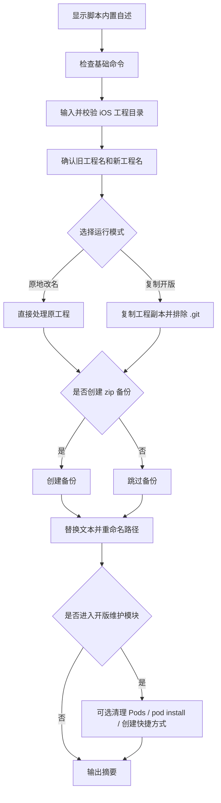

# `【MacOS】🧩iOS工程改名工具.command`


[toc]

---

## 🔥 <font id=前言>前言</font>

> 这个工具用于把一个 iOS 工程中的旧工程名批量替换为新的工程项目名，支持原地改名，也支持复制工程副本后做开版改名。

脚本以新改名工具为主干，吸收旧开版脚本中可控的复制副本、清理 [**CocoaPods**](https://cocoapods.org/) 产物、执行 `pod install` 和创建 `.xcworkspace` 快捷方式能力。系统级副作用动作不会默认执行。

---

## 一、适用场景 <a href="#前言" style="font-size:17px; color:green;"><b>🔼</b></a> <a href="#🔚" style="font-size:17px; color:green;"><b>🔽</b></a>

| 场景 | 说明 |
| --- | --- |
| 原地改名 | 直接修改拖入的 iOS 工程目录。 |
| 复制开版 | 先复制工程到指定父目录下的新工程名目录，再对副本改名。 |
| Pod 工程维护 | 改名后可选删除 `Pods`、`Podfile.lock`、`.xcworkspace` 并重新 `pod install`。 |
| 混合工程改名 | 同时存在 [**Xcode**](https://developer.apple.com/xcode)、Pod、[**Swift**](https://www.swift.org/) Package 配置时统一处理。 |

脚本默认跳过这些目录，避免改动第三方依赖或构建产物：

```text
.git
Pods
node_modules
.dart_tool
build
DerivedData
```

## 二、运行方式 <a href="#前言" style="font-size:17px; color:green;"><b>🔼</b></a> <a href="#🔚" style="font-size:17px; color:green;"><b>🔽</b></a>

推荐在 [**Finder**](https://support.apple.com/guide/mac-help/welcome/mac) 中打开当前目录，双击：

```text
./【MacOS】🧩iOS工程改名工具.command
```

终端运行方式如下：

```shell
chmod +x './【MacOS】🧩iOS工程改名工具.command'
'./【MacOS】🧩iOS工程改名工具.command'
```

运行后按提示操作：

1. 把 iOS 工程目录拖入终端，或手动输入目录路径。
2. 确认旧工程名；检测不准时可以手动输入旧工程名。
3. 输入新的工程项目名。
4. 选择运行模式：`1` 原地改名，`2` 复制开版。
5. 按需创建 `zip` 备份。
6. 执行文本替换和文件目录重命名。
7. 按需进入开版维护模块。

## 三、运行模式 <a href="#前言" style="font-size:17px; color:green;"><b>🔼</b></a> <a href="#🔚" style="font-size:17px; color:green;"><b>🔽</b></a>

| 模式 | 行为 | 风险 |
| --- | --- | --- |
| `1` 原地改名 | 直接处理拖入的工程目录。 | 会修改原工程，建议先备份。 |
| `2` 复制开版 | 将工程复制到指定父目录下的 `新工程名/`，默认排除 `.git`，再处理副本。 | 原工程不被改名；副本会被修改。 |

复制开版模式会要求目标目录不存在，避免覆盖已有工程。

## 四、覆盖范围 <a href="#前言" style="font-size:17px; color:green;"><b>🔼</b></a> <a href="#🔚" style="font-size:17px; color:green;"><b>🔽</b></a>

脚本会做两类基础改名：

- 文本替换：扫描工程内可识别为文本的文件，将旧工程名替换为新工程名。
- 路径改名：重命名文件名或目录名中包含旧工程名的路径，最后再处理工程根目录。

常见会被覆盖的内容包括：

| 类型 | 例子 |
| --- | --- |
| Xcode 工程 | `.xcodeproj`、`.xcworkspace`、`project.pbxproj`、`.xcscheme`。 |
| CocoaPods | `Podfile`、`Podfile.lock`、`*.podspec`、`.xcconfig`。 |
| Swift Package | `Package.swift`、SPM 相关文本配置。 |
| 源码与资源 | `.swift`、`.h`、`.m`、`.mm`、`.plist`、`.storyboard`、`.xib`、`.json`、`.yml`、`.md` 等文本文件。 |

## 五、开版维护模块 <a href="#前言" style="font-size:17px; color:green;"><b>🔼</b></a> <a href="#🔚" style="font-size:17px; color:green;"><b>🔽</b></a>

改名完成后可以选择进入开版维护模块：

| 动作 | 确认方式 | 说明 |
| --- | --- | --- |
| 删除 `Pods`、`Podfile.lock`、根目录下 `.xcworkspace` | 必须输入 `YES` | 删除类动作不会靠回车默认执行。 |
| 执行 `pod install` | 输入任意字符后回车 | 需要本机存在 `pod` 命令，可能联网。 |
| 创建 `.xcworkspace` 桌面快捷方式 | 输入任意字符后回车 | 目标存在时自动跳过并记录失败明细。 |

旧脚本里的系统级动作没有并入本工具默认流程，包括 `sudo spctl --master-disable`、全局 Git 配置、[**Homebrew**](https://brew.sh/) 升级、Oh My Zsh 安装或升级、Rosetta 安装、jq / fzf 自动安装升级、按公网 IP 改 Pod 镜像。

## 六、风险说明 <a href="#前言" style="font-size:17px; color:green;"><b>🔼</b></a> <a href="#🔚" style="font-size:17px; color:green;"><b>🔽</b></a>

- 原地改名会直接修改拖入工程目录。
- 复制开版默认不复制 `.git`，适合从旧项目开新项目。
- 备份不是默认执行；询问备份时直接回车会跳过，输入任意字符后回车才会创建 `zip`。
- 删除 `Pods`、`Podfile.lock`、`.xcworkspace` 必须输入 `YES`。
- 脚本不自动执行 `xcodebuild`、`flutter clean` 或系统级配置命令。

## 七、日志文件 <a href="#前言" style="font-size:17px; color:green;"><b>🔼</b></a> <a href="#🔚" style="font-size:17px; color:green;"><b>🔽</b></a>

终端输出会同步写入系统临时目录中的日志文件：

```text
$TMPDIR/【MacOS】🧩iOS工程改名工具.log
```

脚本结束时会输出：

- 运行模式。
- 源工程目录。
- 当前工程目录。
- 旧工程名和新工程名。
- 文本替换文件数。
- 重命名文件数和目录数。
- 开版清理项数。
- `pod install` 执行状态。
- 备份文件位置。
- 失败明细。

## 八、流程图 <a href="#前言" style="font-size:17px; color:green;"><b>🔼</b></a> <a href="#🔚" style="font-size:17px; color:green;"><b>🔽</b></a>



## 九、常见问题 <a href="#前言" style="font-size:17px; color:green;"><b>🔼</b></a> <a href="#🔚" style="font-size:17px; color:green;"><b>🔽</b></a>

### 9.1、为什么拖入路径后一直提示不正确？

脚本只接受能识别出 iOS 工程特征的目录。目录内至少要能在两层深度内找到下面之一：

```text
*.xcodeproj
*.xcworkspace
Package.swift
Podfile
*.podspec
```

### 9.2、复制开版会改原工程吗？

不会。复制开版会先复制出新目录，再对副本执行改名。原工程只会被读取。

### 9.3、会不会改 `Pods` 里的第三方代码？

基础改名阶段不会。`Pods` 属于默认跳过目录。开版维护模块中如果输入 `YES`，会直接删除整个 `Pods` 目录并等待后续 `pod install` 重建。

### 9.4、脚本会自动验证 Xcode 是否能编译吗？

不会。脚本只做改名和开版维护，不自动运行 `xcodebuild`。

<a id="🔚" href="#前言" style="font-size:17px; color:green; font-weight:bold;">我是有底线的➤点我回到首页</a>
