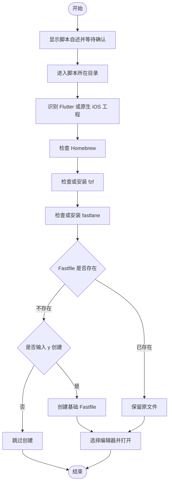

# `【MacOS】📦Fastfile.command`


[toc]

---

## 🔥 <font id=前言>前言</font>

> `Fastfile` 是 [**fastlane**](https://fastlane.tools) 的核心配置文件，用 [**Ruby**](https://www.ruby-lang.org) DSL 描述 iOS 自动化流程。它负责告诉 `fastlane` 要执行哪些构建、测试、签名、打包或上传步骤；真正执行这些流程的是 `fastlane`。

`【MacOS】📦Fastfile.command` 是一个 `Fastfile` 初始化辅助脚本：它准备 [**Homebrew**](https://brew.sh/)、[**fzf**](https://formulae.brew.sh/formula/fzf) 和 `fastlane` 环境，按需创建 `./fastlane/Fastfile`，再用选定的编辑器打开文件。

该脚本只负责准备环境和生成基础模板，不会自动构建 `.ipa`，也不会自动上传 [**TestFlight**](https://developer.apple.com/testflight/) 或 App Store。

## 一、`Fastfile` 是干什么的？ <a href="#前言" style="font-size:17px; color:green;"><b>🔼</b></a> <a href="#🔚" style="font-size:17px; color:green;"><b>🔽</b></a>

[**Fastfile 官方文档**](https://docs.fastlane.tools/advanced/Fastfile/) 将自动化任务组织成平台、通道和动作：

| 概念 | 作用 | 示例 |
| --- | --- | --- |
| `platform` | 区分 iOS、Android 等平台 | `platform :ios` |
| `lane` | 定义一条可重复执行的自动化流程 | `lane :beta` |
| `action` | 组成流程的具体步骤 | `build_app`、`scan`、`upload_to_testflight` |

可以把它理解为：

> `Fastfile` 写“要做什么”，`fastlane` 负责“按顺序执行”。

配置完成后，可以通过终端运行指定通道：

```shell
fastlane ios beta
```

一条完整的 `lane` 可以按实际需要串联以下任务：

- 执行单元测试或 UI 测试。
- 读取工程、工作区、Scheme 和签名配置。
- 构建并导出 `.app` 或 `.ipa`。
- 上传到 TestFlight、App Store 或第三方分发平台。
- 发送通知、生成变更记录或执行其它发布后动作。

`Fastfile` 本身不会在保存后自动执行；只有主动运行对应的 `fastlane` 命令，自动化流程才会开始。

## 二、脚本具体做什么？ <a href="#前言" style="font-size:17px; color:green;"><b>🔼</b></a> <a href="#🔚" style="font-size:17px; color:green;"><b>🔽</b></a>

- 根据脚本所在目录识别原生 iOS 工程或 [**Flutter**](https://flutter.dev/) 工程。
- 检查并按需安装 Homebrew、fzf 和 fastlane。
- 已安装 fzf 或 fastlane 时，询问是否升级对应工具。
- 在脚本所在目录下按需创建 `./fastlane/Fastfile`。
- 使用 fzf 选择 [**Xcode**](https://developer.apple.com/xcode)、[**Visual Studio Code**](https://code.visualstudio.com) 或 [**Android Studio**](https://developer.android.com/studio?hl=zh-c) 打开 `Fastfile`。
- fzf 不可用或取消选择时，按“Visual Studio Code → Xcode → Android Studio”的顺序寻找可用编辑器。

脚本不会执行以下操作：

- 不会主动运行任何 `lane`。
- 不会直接调用 `xcodebuild` 构建工程。
- 不会自动生成可发布的 `.ipa`。
- 不会自动登录开发者账号或上传安装包。
- 不会覆盖已经存在的 `./fastlane/Fastfile`。

## 三、适用场景 <a href="#前言" style="font-size:17px; color:green;"><b>🔼</b></a> <a href="#🔚" style="font-size:17px; color:green;"><b>🔽</b></a>

- 原生 iOS 工程第一次接入 fastlane，需要生成 `./fastlane/Fastfile`。
- Flutter 工程需要在 iOS 子工程中初始化 fastlane。
- 新 Mac 需要补齐 Homebrew、fzf 和 fastlane 工具链。
- 已有 `Fastfile`，需要快速检查工具环境并打开文件继续编辑。

脚本始终以自身所在目录作为工作目录，不会弹窗让用户选择另一个工程。因此，运行前必须先把 `【MacOS】📦Fastfile.command` 放到目标目录：

- 原生 iOS：放到 `.xcodeproj` 或 `.xcworkspace` 所在目录。
- Flutter：推荐放到 `./ios/`，使生成位置落在 `./ios/fastlane/Fastfile`。

如果直接在当前脚本仓库中运行，生成的 `fastlane/` 也会位于当前脚本目录，而不会进入其它 iOS 工程。

## 四、执行前检查 <a href="#前言" style="font-size:17px; color:green;"><b>🔼</b></a> <a href="#🔚" style="font-size:17px; color:green;"><b>🔽</b></a>

- 确认脚本已经复制到正确的工程目录。
- 确认网络可以访问 Homebrew 和 fastlane 相关资源。
- 建议先提交或备份工程中的本地改动。
- 检查目标目录是否已有 `./fastlane/Fastfile`；已有文件不会被覆盖。
- 预留足够时间：Homebrew 安装、更新或升级可能耗时较长。
- 当前脚本检测到已安装的 Homebrew 后，会执行 `brew update`、`brew upgrade` 和 `brew cleanup`，可能更新本机其它 Homebrew 软件包。
- 首次安装 Homebrew 时，脚本可能向当前 Shell 配置文件写入 `shellenv`。

## 五、运行方式 <a href="#前言" style="font-size:17px; color:green;"><b>🔼</b></a> <a href="#🔚" style="font-size:17px; color:green;"><b>🔽</b></a>

### 5.1、双击运行

1. 将 `【MacOS】📦Fastfile.command` 复制到目标工程目录。
2. 双击脚本。
3. 阅读脚本内置自述，按回车继续；按 `Ctrl+C` 可在确认阶段取消。
4. 脚本再次展示 fastlane 初始化说明后，按回车进入环境检查。
5. 根据终端提示决定是否升级工具、创建 `Fastfile` 和选择编辑器。

### 5.2、终端运行

以下命令需要在已经放入脚本的目标工程目录中执行：

```shell
chmod +x './【MacOS】📦Fastfile.command'
'./【MacOS】📦Fastfile.command'
```

不要只在终端切换到工程目录后调用其它位置的脚本。脚本依据自身目录定位工程，而不是依据终端当前目录定位工程。

## 六、生成的基础模板 <a href="#前言" style="font-size:17px; color:green;"><b>🔼</b></a> <a href="#🔚" style="font-size:17px; color:green;"><b>🔽</b></a>

目标目录不存在 `./fastlane/Fastfile` 时，输入 `y` 才会创建下面的基础模板：

```ruby
# Fastfile initialized by Jobs script
default_platform(:ios)

platform :ios do
  desc "Build for beta"
  lane :beta do
    # build_app(scheme: "YourScheme")
  end
end
```

该模板只建立了 `ios beta` 通道，`build_app` 仍处于注释状态。需要先填写真实 Scheme、导出方式、签名和分发动作，再运行：

```shell
fastlane ios beta
```

在未补充动作前执行这条命令，只会进入一个没有实际打包步骤的空通道。

## 七、执行流程 <a href="#前言" style="font-size:17px; color:green;"><b>🔼</b></a> <a href="#🔚" style="font-size:17px; color:green;"><b>🔽</b></a>



## 八、文件与影响范围 <a href="#前言" style="font-size:17px; color:green;"><b>🔼</b></a> <a href="#🔚" style="font-size:17px; color:green;"><b>🔽</b></a>

| 项目 | 位置或行为 |
| --- | --- |
| 主脚本 | `./【MacOS】📦Fastfile.command` |
| 生成目录 | `./fastlane/` |
| 生成文件 | `./fastlane/Fastfile` |
| 运行日志 | 系统临时目录中的 `【MacOS】📦Fastfile.log` |
| 环境配置 | 首次安装 Homebrew 时可能修改当前 Shell 的配置文件 |
| 网络访问 | Homebrew 安装源及软件包仓库 |
| 外部应用 | Xcode、Visual Studio Code 或 Android Studio |

日志主要记录 Jobs 标准外壳输出；环境工具自己的完整输出仍应以当前终端内容为准。

## 九、风险说明 <a href="#前言" style="font-size:17px; color:green;"><b>🔼</b></a> <a href="#🔚" style="font-size:17px; color:green;"><b>🔽</b></a>

- Homebrew 更新和升级会影响本机由 Homebrew 管理的其它软件，不只影响当前工程。
- `brew cleanup` 可能清理旧版本软件包和缓存。
- 首次安装 Homebrew、fzf 或 fastlane 需要联网，并会修改用户级开发环境。
- 创建 `Fastfile` 前必须输入 `y`；其它输入会跳过，已有文件不会被覆盖。
- 不要在 `Fastfile` 中硬编码账号密码、私钥或 Token；敏感信息应通过安全的环境变量或密钥管理方案注入。
- 真正执行包含签名、构建或上传动作的 `lane` 前，应再次检查 Bundle ID、Team、证书、描述文件、Scheme 和导出方式。

为避免安装或升级本机工具，阅读本 README 时不应顺手执行脚本；需要验证时应在明确的目标工程和可控环境中运行。

## 十、常见问题 <a href="#前言" style="font-size:17px; color:green;"><b>🔼</b></a> <a href="#🔚" style="font-size:17px; color:green;"><b>🔽</b></a>

### 10.1、为什么运行结束后没有生成 `.ipa`？

该脚本只初始化环境和 `Fastfile`。生成 `.ipa` 需要在 `lane` 中配置 `build_app` 等动作，再主动执行对应的 `fastlane` 命令。

### 10.2、为什么提示无法识别工程类型？

脚本只检查自身所在目录。原生 iOS 目录需要包含 `.xcodeproj` 或 `.xcworkspace`；Flutter 根目录需要同时包含 `pubspec.yaml` 和 `ios/`。

### 10.3、Flutter 工程的 `Fastfile` 应该放在哪里？

推荐把脚本放到 Flutter 工程的 `./ios/` 后运行，最终文件位于 `./ios/fastlane/Fastfile`。

### 10.4、已有 `Fastfile` 会被覆盖吗？

不会。脚本检测到现有文件后会直接保留，并进入编辑器选择流程。

### 10.5、没有安装 fzf 能否继续？

可以。脚本会尝试通过 Homebrew 安装 fzf；如果安装失败或用户取消选择，会按可用编辑器优先级自动降级。

### 10.6、在哪里查看日志？

查看系统临时目录中的 `【MacOS】📦Fastfile.log`。如果需要排查 Homebrew、fzf 或 fastlane 的详细输出，同时保留当前终端内容。

<a id="🔚" href="#前言" style="font-size:17px; color:green; font-weight:bold;">我是有底线的➤点我回到首页</a>
