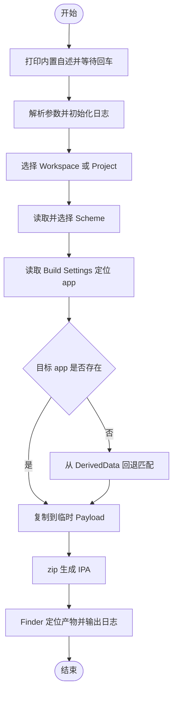

# `【MacOS】📦双击自动生成ipa文件.command`


[toc]

---

## 🔥 <font id=前言>前言</font>

- 本文档对应脚本：`./【MacOS】📦双击自动生成ipa文件.command`。
- 脚本当前定位是：从 [**Xcode**](https://developer.apple.com/xcode) 已经生成的真机 `.app` 中选择目标，并封装为 `Payload/*.ipa`。
- **能力边界**：脚本当前不会从源码执行编译、`archive`、`-exportArchive`、分发签名、证书同步或上传；它不是完整的 iOS 发布流水线。
- 脚本使用 macOS 原生 `zsh` 和系统命令完成本地封装，不依赖 [**Ruby**](https://www.ruby-lang.org)；如需可复现构建、签名、TestFlight、App Store 或 CI，应优先采用 [**fastlane**](https://fastlane.tools)。

## 一、脚本用途 <a href="#前言" style="font-size:17px; color:green;"><b>🔼</b></a> <a href="#🔚" style="font-size:17px; color:green;"><b>🔽</b></a>

| 项目 | 当前行为 |
| --- | --- |
| 工程识别 | 递归查找 `.xcworkspace` / `.xcodeproj`，优先列出 Workspace |
| Scheme 选择 | 读取 `xcodebuild -list`，优先展示名称为 `B` 或以 `B_` 开头的 Scheme |
| `.app` 定位 | 先读取 Build Settings，再从 `DerivedData` 回退查找 |
| IPA 生成 | 把已有 `.app` 复制到临时 `Payload`，再用 `zip` 生成 `.ipa` |
| 默认配置 | `Release` |
| 默认输出 | 桌面 |
| 联网 | IPA 封装流程不需要联网 |
| 第三方依赖 | [**fzf**](https://formulae.brew.sh/formula/fzf) 可选；缺失时自动选择列表第一项 |
| 当前不负责 | 编译、测试、Archive、Export、签名管理、版本号、TestFlight、App Store |

### 1.1、适用场景

- 已经通过 Xcode 或其它流程生成了正确签名的真机 `.app`，只想快速封装成 `.ipa`。
- 个人本机临时测试，接受使用本机现有 `DerivedData`。
- 希望保留“双击运行、可视化选择、完成后在 Finder 定位产物”的轻量交互。

### 1.2、不适用场景

- 需要保证“每次都从当前源码重新构建”的正式包。
- 需要 `Development`、`Ad Hoc`、`Enterprise`、`App Store Connect` 等规范导出。
- 需要自动管理证书、描述文件、Bundle ID、Entitlements 或多 Target 签名。
- 需要上传 TestFlight / App Store、提交审核、管理商店元数据或接入 CI。

## 二、运行方式 <a href="#前言" style="font-size:17px; color:green;"><b>🔼</b></a> <a href="#🔚" style="font-size:17px; color:green;"><b>🔽</b></a>

运行前确认：

- 已安装 Xcode，并且 `xcodebuild` 可用。
- 目标 Scheme 已经生成真机 `.app`，对应目录通常带有 `iphoneos`。
- 多工程环境优先显式传入 `--project` 和 `--scheme`，避免回退逻辑选择错误目标。
- 如果输出目录已有同名 `.ipa`，先移走旧文件，避免 `zip` 更新旧压缩包时保留已经删除的历史条目。

推荐双击 `./【MacOS】📦双击自动生成ipa文件.command` 运行。终端方式如下：

```shell
chmod +x './【MacOS】📦双击自动生成ipa文件.command'
./【MacOS】📦双击自动生成ipa文件.command
```

脚本会先打印内置自述并等待回车确认；运行时不会读取或显示本 README。

### 2.1、命令参数

```shell
./【MacOS】📦双击自动生成ipa文件.command \
  --project '/path/to/App.xcworkspace' \
  --scheme 'App' \
  --config 'Release' \
  --out "${HOME}/Desktop" \
  --confirm
```

| 参数 | 作用 | 备注 |
| --- | --- | --- |
| `--project` | 指定 `.xcworkspace` 或 `.xcodeproj` | 建议多工程环境显式传入 |
| `--scheme` | 指定 Scheme | 未传入时自动读取并选择 |
| `--config` | 指定 Configuration | 默认 `Release`；当前只影响 `.app` 路径解析 |
| `--out` | 指定 IPA 输出目录 | 默认桌面 |
| `--confirm` | 封装前再次确认工程、Scheme、配置和输出目录 | 不影响最外层防误触确认 |
| `--target` | 当前仅解析和记录 | **尚未参与选择或打包，不应依赖** |

## 三、实际执行流程 <a href="#前言" style="font-size:17px; color:green;"><b>🔼</b></a> <a href="#🔚" style="font-size:17px; color:green;"><b>🔽</b></a>

1. 打印脚本内置自述，等待回车确认。
2. 解析命令参数，初始化输出目录和日志。
3. 以脚本所在 Git 仓库为默认扫描根目录。
4. 查找并选择 `.xcworkspace` 或 `.xcodeproj`。
5. 通过 `xcodebuild -list` 读取 Scheme。
6. 通过 `xcodebuild -showBuildSettings` 解析 `CODESIGNING_FOLDER_PATH`，或者组合 `TARGET_BUILD_DIR` 与 `WRAPPER_NAME`。
7. 如果 Build Settings 没有定位到可用 `.app`，从 `DerivedData` 中回退选择最近修改的 `iphoneos/*.app`。
8. 将 `.app` 复制到临时 `Payload` 目录，压缩生成 `.ipa`。
9. 在 Finder 中定位生成结果。

> 注意：第 6 步只是读取构建设置，不会触发 Build；第 7 步可能命中旧产物。文件扩展名是 `.ipa`，不等于它已经符合目标分发方式的签名和导出要求。

## 四、🆚 fastlane <a href="#前言" style="font-size:17px; color:green;"><b>🔼</b></a> <a href="#🔚" style="font-size:17px; color:green;"><b>🔽</b></a>

[**fastlane**](https://fastlane.tools) 是移动端构建与发布自动化工具集。它不替代 Xcode 编译器，而是通过 `Fastfile` 中的 Lane 编排 `xcodebuild`、测试、签名、版本号、截图、TestFlight、App Store 和通知等动作。

对比基线：

- README 核对日期：`2026-07-24`。
- 本机核对版本：`fastlane 2.237.0`。
- 官方能力参考：[build_app](https://docs.fastlane.tools/actions/build_app/)、[match](https://docs.fastlane.tools/actions/match/)、[TestFlight](https://docs.fastlane.tools/actions/testflight/)、[deliver](https://docs.fastlane.tools/actions/deliver/)。

| 能力 | 当前 `.command` 脚本 | fastlane |
| --- | --- | --- |
| 双击交互 | 原生支持 | 默认命令行；可再包一层 `.command` |
| 从源码重新构建 | **不支持** | `build_app` / `gym` 支持 |
| Archive 与 Export | **不支持** | 支持标准 `archive`、导出和 IPA 生成 |
| 已有 `.app` 快速压成 IPA | 支持，流程轻量 | 可以实现，但仅做这一步偏重 |
| 分发签名 | 不处理、不重签 | 可配置自动签名或导出选项 |
| 证书与描述文件 | 不管理 | 可通过 `match` 统一管理 |
| 多 Scheme / 多环境 | 交互选择；配置较弱 | Lane、参数、环境变量均可编排 |
| 单元测试 / UI 测试 | 不支持 | 可通过 `run_tests` / `scan` 编排 |
| 版本号 / Build 号 | 不支持 | 支持自动读取和递增 |
| TestFlight | 不支持 | `upload_to_testflight` / `pilot` 支持 |
| App Store | 不支持 | `upload_to_app_store` / `deliver` 支持 |
| 商店截图与元数据 | 不支持 | 支持截图、元数据与提审流程 |
| CI / 团队复现 | 弱，依赖本机 `DerivedData` | 强，可接入主流 CI |
| 依赖成本 | 低，主要依赖 macOS / Xcode | 较高，建议用 Bundler 和 `Gemfile` 锁定版本 |
| 维护成本 | 功能越多，Shell 自维护成本越高 | 初始配置较多，后续发布流程更标准 |

### 4.1、怎么选

- **只想把已经构建并签名的 `.app` 临时封装成 IPA**：保留当前脚本更直接。
- **想要真正的“一键从源码生成可分发 IPA”**：使用 fastlane `build_app`，或者补齐原生 `xcodebuild archive` + `-exportArchive`。
- **要发 TestFlight / App Store、多人协作或接入 CI**：优先 fastlane。
- **兼顾 Jobs 双击体验与发布能力**：推荐保留 `.command` 作为交互入口，由它调用 `bundle exec fastlane ios <lane>`；核心构建、签名和上传逻辑放进 `Fastfile`。

### 4.2、当前结论

当前脚本是“已有 `.app` 的轻量 IPA 封装器”，fastlane 是“可扩展的构建与发布流水线”。两者不是同一级别的完整替代关系：

- 本地临时封装：当前脚本更轻。
- 正式构建与发布：fastlane 明显更完整、更可复现。

## 五、已知风险与限制 <a href="#前言" style="font-size:17px; color:green;"><b>🔼</b></a> <a href="#🔚" style="font-size:17px; color:green;"><b>🔽</b></a>

- **不是干净构建**：脚本不会执行 `clean`、`build` 或 `archive`，可能封装旧 `.app`。
- **不是规范导出**：脚本没有 `ExportOptions.plist`，也不执行 `xcodebuild -exportArchive`。
- **不验证签名**：封装前没有执行 `codesign --verify`，无法保证 IPA 可安装或可上传。
- **回退目标存在歧义**：如果找不到同名 `.app`，会选择 `DerivedData` 中最近修改的任意 `iphoneos/*.app`。
- **Homebrew PATH 受限**：核心逻辑会把 `PATH` 收窄到系统目录；安装在 `/opt/homebrew/bin` 的 `fzf` 可能无法被识别，多选场景会退化为取第一项。
- **同名 IPA 可能被增量更新**：`zip` 没有先删除旧 IPA，旧压缩包中的历史文件可能残留。
- **`--target` 尚未生效**：当前只记录参数，没有参与 Target 或 Scheme 选择。

## 六、日志与排查 <a href="#前言" style="font-size:17px; color:green;"><b>🔼</b></a> <a href="#🔚" style="font-size:17px; color:green;"><b>🔽</b></a>

- 日志文件：系统 `/tmp` 目录中的 `【MacOS】📦双击自动生成ipa文件.command.log`。
- 失败时脚本会尝试自动打开日志。
- 优先检查以下字段：`XCODEBUILD_LIST_EXIT`、`XCODEBUILD_SHOWBUILDSETTINGS_EXIT`、`DERIVED_MATCH_COUNT`、`app_path`、`ipa`。

### 6.1、常见问题

#### 6.1.1、生成了 IPA，但装不上

`.ipa` 只是封装格式。先确认内部 `.app` 面向真机、签名有效、描述文件包含目标设备，并且导出方式符合用途。正式分发建议改用 Xcode Archive / Export 或 fastlane `build_app`。

#### 6.1.2、选错了工程或 Scheme

不要依赖自动回退，显式传入：

```shell
./【MacOS】📦双击自动生成ipa文件.command \
  --project '/path/to/App.xcworkspace' \
  --scheme 'App'
```

#### 6.1.3、找不到 `.app`

先在 Xcode 中为真机完成一次构建，再检查目标 Configuration 和 Scheme；或者改用 fastlane 直接从源码构建。

## 七、流程图 <a href="#前言" style="font-size:17px; color:green;"><b>🔼</b></a> <a href="#🔚" style="font-size:17px; color:green;"><b>🔽</b></a>



## 八、验证状态 <a href="#前言" style="font-size:17px; color:green;"><b>🔼</b></a> <a href="#🔚" style="font-size:17px; color:green;"><b>🔽</b></a>

- `zsh -n ./【MacOS】📦双击自动生成ipa文件.command`：已通过。
- 已核对本机 `fastlane 2.237.0` 与官方文档。
- 未实际执行 IPA 打包、签名、安装、TestFlight 或 App Store 上传。

<a id="🔚" href="#前言" style="font-size:17px; color:green; font-weight:bold;">我是有底线的➤点我回到首页</a>
