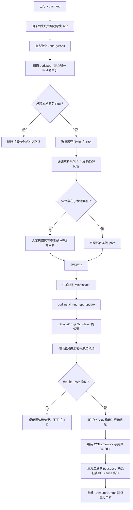

# Jobs Pod 二进制打包器

[toc]

---

## 一、它解决什么问题

这是一个只面向 macOS 的原生 GUI 工具。入口是：

```text
【MacOS】📦生成JobsPod二进制打包器.command
```

双击后，脚本先打印固定说明并等待回车。确认后，它使用本机 Xcode 自带的 Swift 编译器，在同级 `Build` 目录生成并启动：

```text
JobsPodBinaryBuilder.app
```

软件用于把一个 Jobs 自建 Pod 及其实际依赖闭包打包成可分发的 `XCFramework` 二进制 SDK，同时把本地来源、远程来源、版本、许可证、源码指纹和验证结果完整告知使用者。

## 二、核心来源规则

### 2.1 本地索引是最高权威来源

把整个统一管理的 `JobsByPods` 目录拖入软件后，工具会扫描其中全部有效 `*.podspec`，建立：

```text
Pod 名 → 唯一本地 podspec → 唯一本地目录
```

主 Pod 的某个依赖只要存在于本地索引中，就自动绑定本地 `:path`。即使 CocoaPods 网络源里存在同名 Pod，也不会静默替换本地代码。

### 2.2 本地同名不是选项，而是目录错误

扫描后如果出现两个同名本地 Pod，任务直接阻断并打印全部冲突路径。工具不会提供“二选一”，避免同一版本产生不可重复的二进制。

### 2.3 只有本地不存在时才人工仲裁

缺失依赖会停留在界面中，提供：

- `查询 CocoaPods`：只查询元数据，展示名称、版本、来源、依赖方和许可证；用户按 Enter 后才接受远程来源。
- `选择本地目录`：补充遗漏的自建 Pod 或本地托管第三方 Pod。
- `取消当前任务`：中止当前 CocoaPods 或 Xcode 子进程。

版本约束冲突不会自动改走网络。工具会明确报告依赖方、要求版本和当前本地版本，要求先修正约束或补充正确的本地目录。

## 三、完整闭环



## 四、最终产物

一次成功任务会生成类似目录：

```text
JobsMain-BinarySDK-20260730-153000/
├── JobsMain.xcframework
├── Dependencies/
│   └── JobsNetworking.xcframework
├── Resources/
│   └── JobsMainResources.bundle
├── JobsMain.podspec
├── Podfile.lock
├── DependencyProvenance.json
├── DependencyProvenance.html
├── THIRD_PARTY_NOTICES.md
├── ConsumerDemo/
└── Logs/
    └── JobsPodBinaryBuilder.log
```

来源报告会列出：

| 字段 | 含义 |
|---|---|
| 模块 | 主 Pod、传递 Pod、系统 Framework 或系统 Library |
| 关系 | 主 Pod、传递依赖或系统依赖 |
| 版本 | podspec 版本或当前 SDK |
| 来源类型 | Jobs 本地、本地托管第三方、补充本地、CocoaPods 远程或 Apple SDK |
| 来源身份 | 本地绝对路径或远程仓库地址 |
| 打包方式 | 主 XCFramework、依赖 XCFramework 或外部链接 |
| 许可证 | podspec 声明的许可证 |
| 验证 | 预编译和链接验证结论 |
| 指纹 | 来源确认前计算的 SHA-256；正式打包前会再次核验 |

公开 HTML 报告不会泄露完整本机绝对路径，只保留目录身份和指纹前缀；本机 JSON 报告保留完整来源，便于内部追溯。

## 五、运行环境

- macOS 14 或更高版本。
- 完整 Xcode，且 `xcrun --find swiftc`、`xcodebuild` 可用。
- CocoaPods，且终端中 `pod --version` 可用。
- 能够满足目标 Pod 远程依赖下载要求的网络环境。

生成 GUI 本身不要求 Python、Node.js、Homebrew GUI 框架或额外运行时。CocoaPods 可以来自 Homebrew 或其它本机有效安装。

## 六、使用步骤

1. 双击 `【MacOS】📦生成JobsPod二进制打包器.command`。
2. 阅读终端中的固定说明，按 Enter 生成并启动 App。
3. 拖入整个 `JobsByPods`，或点击“选择并扫描”。
4. 在左侧选择真正需要打包的主 Pod。
5. 只处理右侧当前依赖链中的缺失来源或版本冲突。
6. 来源闭环后点击“1. 预编译验证”。
7. 预编译通过后点击“2. 查看来源表并正式打包”。
8. 核对最终表格，按 Enter 后开始正式打包。
9. 在进度条和实时日志中观察任务；成功后 Finder 自动定位产物。

## 七、安全与可重复性

- `.command` 在用户确认前不会创建目录、日志或 App。
- 生成器只写入自身同级 `Build` 目录；重复运行只替换明确的 `JobsPodBinaryBuilder.app`。
- GUI 的临时 CocoaPods 工程位于用户缓存目录，每次任务使用独立 UUID。
- 所有本地 Pod 都使用显式绝对 `:path`。
- 所有用户确认的远程 Pod 都使用精确版本。
- `pod install` 固定使用 `--no-repo-update`，避免任务中静默更新 Specs。
- 正式构建前再次计算来源指纹；源码或 podspec 发生变化时必须重新预编译和确认。
- 任务日志写入最终产物，便于复盘真实命令和失败原因。

## 八、当前边界

- 当前面向 iOS Pod，生成 iPhoneOS 与 iOS Simulator 两类切片。
- 一个依赖必须能够由 CocoaPods 生成可定位的 Framework 产品；只有静态库、脚本生成物或特殊 vendored target 的 Pod 可能需要后续适配。
- 工具读取根 spec 与 subspec 中声明的依赖，因此会采用偏保守的完整闭包；不会猜测调用方只使用了哪个 subspec。
- 远程查询先读取当前本机 CocoaPods Specs 中可见版本，最终版本冲突仍由 `pod install` 做权威校验。
- ConsumerDemo 验证的是模块导入、链接和 CocoaPods 集成，不替代业务运行时测试。

## 九、目录说明

```text
【MacOS】📦生成JobsPod二进制打包器.command/
├── 【MacOS】📦生成JobsPod二进制打包器.command
├── README.md
├── JobsPodBinaryBuilder/
│   ├── Sources/
│   │   ├── AppMain.swift
│   │   ├── AppModel.swift
│   │   ├── CommandRunner.swift
│   │   ├── ContentView.swift
│   │   ├── Models.swift
│   │   ├── PackagingEngine.swift
│   │   ├── PodspecService.swift
│   │   └── ProjectGenerator.swift
│   └── Tests/
│       ├── SmokeMain.swift
│       └── PackageSmokeMain.swift
└── Build/                     # 首次按 Enter 后生成
    ├── JobsPodBinaryBuilder.app
    └── 生成JobsPodBinaryBuilder.log
```

<a id="🔚" href="#jobs-pod-二进制打包器" style="font-size:17px; color:green; font-weight:bold;">我是有底线的➤点我回到首页</a>
