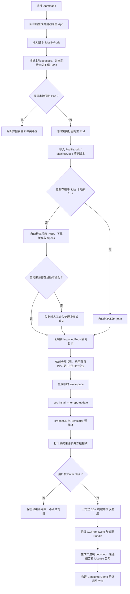

# <span id="前言">Jobs Pod 二进制打包器</span>


[toc]

---

## 一、它解决什么问题 <a href="#前言" style="font-size:17px; color:green;"><b>🔼</b></a> <a href="#🔚" style="font-size:17px; color:green;"><b>🔽</b></a>

这是一个只面向 macOS 的原生 GUI 工具。入口是：

```text
【MacOS】📦生成JobsPod二进制打包器.command
```

双击后，脚本先打印固定说明并等待回车。确认后，它使用本机 [**Xcode**](https://developer.apple.com/xcode) 自带的 [**Swift**](https://www.swift.org/) 编译器，在同级 `Build` 目录生成并启动：

```text
JobsPodBinaryBuilder.app
```

生成的 App 自带专用 macOS 图标：主体使用 [**阿里巴巴矢量图标库 iconfont**](https://www.iconfont.cn/) 的“集成打包”图形，叠加 `01` 二进制标识。原始矢量、素材来源记录和最终 `.icns` 均随项目保存，生成器会自动写入 App Bundle。

软件用于把一个 Jobs 自建 Pod 及其实际依赖闭包打包成可分发的 `XCFramework` 二进制 SDK，同时把 Jobs 本地来源、项目 `Pods` 安装快照、[**CocoaPods**](https://cocoapods.org/) 本机缓存、Specs 来源、版本、许可证、源码指纹和验证结果完整告知使用者。

## 二、核心来源规则 <a href="#前言" style="font-size:17px; color:green;"><b>🔼</b></a> <a href="#🔚" style="font-size:17px; color:green;"><b>🔽</b></a>

### 2.1、本地索引是最高权威来源 <a href="#前言" style="font-size:17px; color:green;"><b>🔼</b></a> <a href="#🔚" style="font-size:17px; color:green;"><b>🔽</b></a>

把整个统一管理的 `JobsByPods` 目录拖入软件后，工具会在后台扫描其中全部有效 `*.podspec`，主线程只接收进度并刷新界面，建立：

```text
Pod 名 → 唯一本地 podspec → 唯一本地目录
```

主 Pod 的某个依赖只要存在于本地索引中，就自动绑定本地 `:path`。即使 CocoaPods 网络源里存在同名 Pod，也不会静默替换本地代码。

### 2.2、本地同名不是选项，而是目录错误 <a href="#前言" style="font-size:17px; color:green;"><b>🔼</b></a> <a href="#🔚" style="font-size:17px; color:green;"><b>🔽</b></a>

扫描后如果出现两个同名本地 Pod，任务直接阻断并打印全部冲突路径。工具不会提供“二选一”，避免同一版本产生不可重复的二进制。

### 2.3、外源 Pod 默认全自动解析 <a href="#前言" style="font-size:17px; color:green;"><b>🔼</b></a> <a href="#🔚" style="font-size:17px; color:green;"><b>🔽</b></a>

导入 `JobsByPods` 后，工具会向上寻找同一 [**Xcode**](https://developer.apple.com/xcode) 工程的 `Pods/Manifest.lock` 与 `Podfile.lock`，自动导入 `pod install` 已经安装的外源 Pod，不再让用户逐项选择。来源优先级固定为：

- 原工程 `Pods/`：当前 `pod install` 的真实安装快照，版本以一致的 `Podfile.lock` / `Pods/Manifest.lock` 为准。
- 当前用户的 CocoaPods 下载缓存：通常位于系统用户缓存目录中的 `CocoaPods/Pods`，保存下载过的 podspec 与源码副本；缓存不是工程锁文件的替代品。
- 当前用户的 CocoaPods Specs 索引：通常位于用户目录下的 `.cocoapods/repos`，用于补足精确版本元数据；只有项目 `Pods` 和下载缓存都没有源码时，后续 `pod install` 才按锁定版本自动下载。

命中原工程 `Pods` 或 CocoaPods 下载缓存时，工具会把对应源码和精确版本 podspec 复制到本次会话的 `ImportedPods` 隔离目录，然后以本地 `:path` 交给 `pod install`。这个过程只读原工程的第三方源码，不会向原 `Pods` 写入 podspec，也不会在本机已有完整源码时再下载同一版本。

如果 `JobsByPods` 不在原工程旁边，左侧提供“导入项目 Pods”，一次选择完整 `Pods` 目录即可。依赖行不再常态展示“查 CocoaPods / 选本地”；只有三层自动来源均未命中、锁文件不一致或版本约束冲突时，才显示“重新自动解析 / 人工补充 / 更换项目 Pods”。依赖链仍需人工介入的主 Pod 会在左侧显示红色感叹号，解决后自动消失。

版本约束冲突不会被网络最新版静默覆盖。工具会明确报告依赖方、要求版本和当前锁定版本，要求先修正原工程约束并执行 `pod install`，或人工导入正确的项目 `Pods`。

## 三、完整闭环 <a href="#前言" style="font-size:17px; color:green;"><b>🔼</b></a> <a href="#🔚" style="font-size:17px; color:green;"><b>🔽</b></a>


```mermaid
flowchart TD
    A["运行 .command"] --> B["回车后生成并启动原生 App"]
    B --> C["拖入整个 JobsByPods"]
    C --> D["扫描本地 podspec，并自动检测同工程 Pods"]
    D --> E{"发现本地同名 Pod？"}
    E -- "是" --> F["阻断并报告全部冲突路径"]
    E -- "否" --> G["选择需要打包的主 Pod"]
    G --> H["导入 Podfile.lock / Manifest.lock 精确版本"]
    H --> I{"依赖存在于 Jobs 本地索引？"}
    I -- "是" --> J["自动绑定本地 :path"]
    I -- "否" --> K["自动检查项目 Pods、下载缓存与 Specs"]
    K --> W{"自动来源存在且版本匹配？"}
    W -- "是" --> L["复制到 ImportedPods 隔离目录"]
    W -- "否" --> X["仅此时人工介入处理冲突或缺失"]
    X --> L
    J --> L
    L --> Y["依赖全部找到，启用醒目的“开始正式打包”按钮"]
    Y --> M["生成临时 Workspace"]
    M --> N["pod install --no-repo-update"]
    N --> O["iPhoneOS 与 Simulator 预编译"]
    O --> P["打印最终来源表并冻结指纹"]
    P --> Q{"用户按 Enter 确认？"}
    Q -- "否" --> R["保留预编译结果，不正式打包"]
    Q -- "是" --> S["正式双 SDK 构建并显示进度"]
    S --> T["组装 XCFramework 与资源 Bundle"]
    T --> U["生成二进制 podspec、来源报告和 License 告知"]
    U --> V["构建 ConsumerDemo 验证最终产物"]
```

## 四、最终产物 <a href="#前言" style="font-size:17px; color:green;"><b>🔼</b></a> <a href="#🔚" style="font-size:17px; color:green;"><b>🔽</b></a>

一次成功任务会生成类似目录：

```text
JobsMain-BinarySDK-20260730-153000/
├── JobsMain.xcframework
├── Dependencies/
│   └── JobsNetworking.xcframework
├── Resources/
│   └── JobsMainResources.bundle
├── JobsMain.podspec
├── Podfile.lock
├── DependencyProvenance.json
├── DependencyProvenance.html
├── THIRD_PARTY_NOTICES.md
├── ConsumerDemo/
└── Logs/
    └── JobsPodBinaryBuilder.log
```

来源报告会列出：

| 字段 | 含义 |
|---|---|
| 模块 | 主 Pod、传递 Pod、系统 Framework 或系统 Library |
| 关系 | 主 Pod、传递依赖或系统依赖 |
| 版本 | podspec 版本或当前 SDK |
| 来源类型 | Jobs 本地、本地托管第三方、补充本地、项目 Pods 自动导入、CocoaPods 本机缓存、CocoaPods Specs 或 Apple SDK |
| 来源身份 | 本地绝对路径或远程仓库地址 |
| 打包方式 | 主 XCFramework、依赖 XCFramework 或外部链接 |
| 许可证 | podspec 声明的许可证 |
| 验证 | 预编译和链接验证结论 |
| 指纹 | 来源确认前计算的 SHA-256；正式打包前会再次核验 |

公开 HTML 报告不会泄露完整本机绝对路径，只保留目录身份和指纹前缀；本机 JSON 报告保留完整来源，便于内部追溯。

## 五、运行环境 <a href="#前言" style="font-size:17px; color:green;"><b>🔼</b></a> <a href="#🔚" style="font-size:17px; color:green;"><b>🔽</b></a>

- macOS 14 或更高版本。
- 完整 Xcode，且 `xcrun --find swiftc`、`xcodebuild` 可用。
- CocoaPods，且终端中 `pod --version` 可用。
- 只有依赖未安装在原工程 `Pods` 且未命中 CocoaPods 下载缓存时，才需要能够下载目标 Pod 的网络环境。

生成 GUI 本身不要求 [**Python**](https://www.python.org)、[**Node.js**](https://nodejs.org)、[**Homebrew**](https://brew.sh/) GUI 框架或额外运行时。CocoaPods 可以来自 Homebrew 或其它本机有效安装。

GUI 会为 CocoaPods、[**Ruby**](https://www.ruby-lang.org) 和 Xcode 子进程统一补齐 UTF-8 locale，并分别采集标准输出与错误输出。即使 Finder 启动 App 时没有继承终端环境，`pod ipc spec` 的 JSON 也不会再被编码警告污染。

## 六、使用步骤 <a href="#前言" style="font-size:17px; color:green;"><b>🔼</b></a> <a href="#🔚" style="font-size:17px; color:green;"><b>🔽</b></a>

1、双击 `【MacOS】📦生成JobsPod二进制打包器.command`。

2、阅读终端中的固定说明，按 Enter 生成并启动 App。

3、拖入整个 `JobsByPods`，或点击“选择并扫描”；工具会自动寻找同工程 `Pods`。

4、如果界面没有自动检测到，在左侧点击“导入项目 Pods”，一次选择原 Xcode 工程的完整 `Pods` 目录。

5、在左侧选择真正需要打包的主 Pod；正常外源依赖会直接显示“无需干预”。

6、左侧出现红色感叹号表示该主 Pod 仍有缺失或版本冲突；只有此时才处理右侧人工入口。

7、依赖全部找到后，底部醒目的“开始正式打包”按钮才会启用；点击一次后，软件自动完成预编译并展示最终来源表。

8、核对最终表格，按 Enter 后开始正式打包。

9、在进度条和实时日志中观察任务；日志与上方工作区之间的分隔线可上下拖动，扫描结束后状态会明确复位为“等待导入 / 依赖闭包已自动解决”。

10、打包成功后弹出“是否打开产物文件夹”对话框；选择打开才会调起 Finder，选择暂不打开则保留当前界面。左侧的 `JobsByPods`、项目 `Pods`、产物输出目录以及日志栏中的最终产物路径都可直接点击打开。

## 七、安全与可重复性 <a href="#前言" style="font-size:17px; color:green;"><b>🔼</b></a> <a href="#🔚" style="font-size:17px; color:green;"><b>🔽</b></a>

- `.command` 在用户确认前不会创建目录、日志或 App。
- 生成器只写入自身同级 `Build` 目录；重复运行只替换明确的 `JobsPodBinaryBuilder.app`。
- GUI 的临时 CocoaPods 工程位于用户缓存目录，每次任务使用独立 UUID。
- Jobs 自建、本地托管和人工补充 Pod 使用显式绝对 `:path`。
- 项目 `Pods` 与 CocoaPods 缓存中的外源 Pod 使用锁文件精确版本，并复制到一次性 `ImportedPods` 会话沙盒；原第三方目录始终只读。
- `Podfile.lock` 与 `Pods/Manifest.lock` 不一致时立即阻断，避免把过期 `Pods` 当成当前安装结果。
- `pod install` 固定使用 `--no-repo-update`，避免任务中静默更新 Specs。
- CocoaPods 的 JSON 解析只读取标准输出，不把机器可读 JSON 推送到界面；错误输出经合并后展示并保留到任务日志。
- JobsByPods 遍历、项目 Pods 快照解析和 CocoaPods Specs 查询都在后台任务执行；子进程输出在后台批量合并，主线程只低频更新进度、可见日志尾部与按钮状态。
- 外部命令失败时，状态卡只显示精简摘要，详细堆栈放在有固定高度的可滚动区域，不会再把界面撑出屏幕。
- 外部命令失败时，弹窗会在末尾堆栈之前提取 `[!]`、`fatal`、`RPC`、`HTTP`、`SSL` 或超时等关键错误行。
- 正式构建前再次计算来源指纹；源码或 podspec 发生变化时必须重新预编译和确认。
- 任务日志写入最终产物，便于复盘真实命令和失败原因。

## 八、当前边界 <a href="#前言" style="font-size:17px; color:green;"><b>🔼</b></a> <a href="#🔚" style="font-size:17px; color:green;"><b>🔽</b></a>

- 当前面向 iOS Pod，生成 iPhoneOS 与 iOS Simulator 两类切片。
- 一个依赖必须能够由 CocoaPods 生成可定位的 Framework 产品；只有静态库、脚本生成物或特殊 vendored target 的 Pod 可能需要后续适配。
- CocoaPods 将纯头文件 Pod 生成为聚合 Target 时，工具会解引用复制公开头文件，并生成无业务逻辑的多架构静态 Framework 锚点；原 Pod 仍然只读。
- 工具读取根 spec 与 subspec 中声明的依赖，因此会采用偏保守的完整闭包；不会猜测调用方只使用了哪个 subspec。
- 外源 Pod 优先采用原工程锁定版本；项目 `Pods` 没有源码时再读下载缓存，缓存也没有时由 `pod install` 按本机 Specs 中的精确版本自动下载。
- ConsumerDemo 验证的是模块导入、链接和 CocoaPods 集成，不替代业务运行时测试。

如果扫描阶段仍然没有任何 podspec 能被解析，错误弹窗会直接列出前三份失败样例，其余完整信息保留在界面实时日志中。优先检查 `pod --version`、podspec 内的 `require_relative` 路径以及 Ruby 报出的具体异常。

## 九、目录说明 <a href="#前言" style="font-size:17px; color:green;"><b>🔼</b></a> <a href="#🔚" style="font-size:17px; color:green;"><b>🔽</b></a>

```text
【MacOS】📦生成JobsPod二进制打包器.command/
├── 【MacOS】📦生成JobsPod二进制打包器.command
├── README.md
├── JobsPodBinaryBuilder/
│   ├── Resources/
│   │   ├── JobsPodBinaryBuilder-AppIcon.svg
│   │   ├── JobsPodBinaryBuilder-AppIcon-1024.png
│   │   ├── JobsPodBinaryBuilder.icns
│   │   └── AppIconSource.json
│   ├── Sources/
│   │   ├── AppMain.swift
│   │   ├── AppModel.swift
│   │   ├── CommandRunner.swift
│   │   ├── ContentView.swift
│   │   ├── Models.swift
│   │   ├── PackagingEngine.swift
│   │   ├── PodspecService.swift
│   │   └── ProjectGenerator.swift
│   └── Tests/
│       ├── ImportedPodsInstallMain.swift
│       ├── SmokeMain.swift
│       └── PackageSmokeMain.swift
└── Build/                     # 首次按 Enter 后生成
    ├── JobsPodBinaryBuilder.app
    └── 生成JobsPodBinaryBuilder.log
```

<a id="🔚" href="#jobs-pod-二进制打包器" style="font-size:17px; color:green; font-weight:bold;">我是有底线的➤点我回到首页</a>
